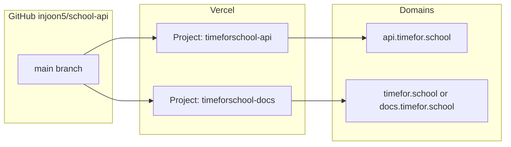

# Vercel deployment plan

This monorepo ships **two separate Vercel projects** from one GitHub repository. Do not use a single project for both—the API (Elysia serverless) and the docs (Next.js static/SSG) have different roots, builds, and domains.

## Architecture



| Project | Root directory | Framework | Production domain (suggested) |
| ------- | -------------- | --------- | ----------------------------- |
| **API** | `.` (repo root) | Elysia (auto-detected) | `api.timefor.school` |
| **Docs** | `apps/docs` | Next.js | `timefor.school` or `docs.timefor.school` |

Preview deployments: every PR gets preview URLs on **both** projects if both are linked to the repo (optional: only enable docs previews).

---

## 1. API project (Elysia)

### Create project

1. [Vercel Dashboard](https://vercel.com/new) → Import `injoon5/school-api`.
2. **Project name:** e.g. `timeforschool-api`.
3. **Root Directory:** leave as **`.`** (repository root).
4. **Framework Preset:** Other / auto (Elysia default export from `src/app.ts` is detected).
5. **Build Command:** leave empty or `npm run build` (optional; serverless may not need a full `tsc` build).
6. **Output:** none (serverless function, not static export).
7. **Install Command:** `npm install`.

### Environment variables

| Name | Environments | Notes |
| ---- | ------------ | ----- |
| `NEIS_API_KEY` | Production, Preview | NEIS Open API key |

### Domain

- Add `api.timefor.school` in **Settings → Domains**.
- Remove default `*.vercel.app` from production only if you want (keep for previews).

### Local parity

```bash
npm run dev                    # localhost:8000
npx vercel link                # link API project at repo root
npx vercel env pull .env.local
npx vercel dev                 # Vercel dev proxy
npm run vercel:deploy          # production CLI deploy
```

### `vercel.json` (root)

Current file is minimal schema-only; Elysia needs no extra routes. Optional later:

- `bunVersion` if switching runtime to Bun.
- Headers / CORS only if not handled in `src/app.ts`.

---

## 2. Docs project (Fumadocs + Next.js)

### Create project

1. Import the **same** GitHub repo again (second Vercel project).
2. **Project name:** e.g. `timeforschool-docs`.
3. **Root Directory:** **`apps/docs`** (required).
4. **Framework:** Next.js (from `apps/docs/package.json`).

`apps/docs/vercel.json` already sets monorepo-aware install/build:

```json
{
  "installCommand": "cd ../.. && npm install",
  "buildCommand": "cd ../.. && npm run openapi:sync && npm run build -w @timeforschool/docs"
}
```

Vercel runs these **from `apps/docs`**, so `cd ../..` reaches the repo root and installs all workspaces.

### Environment variables

| Name | Environments | Notes |
| ---- | ------------ | ----- |
| `NEXT_PUBLIC_DOCS_URL` | Production | Canonical URL for OG/metadata, e.g. `https://timefor.school` |

### Domain options

**Option A — subdomain (simplest)**  
- `docs.timefor.school` → docs project only.  
- No path conflicts with marketing site.

**Option B — apex + path**  
- `timefor.school` on docs project; marketing at `/` is this app’s home page.  
- Or use Vercel rewrites from a separate marketing project to `/docs` on this app (more moving parts).

**Option C — path on API domain (not recommended)**  
- Avoid serving Next and Elysia on the same project.

### Monorepo setting

In **Settings → General**, enable **“Include source files outside of the Root Directory in the Build Step”** if installs fail to resolve `fumadocs-*` / workspace hoisting. The custom `installCommand` usually makes this unnecessary.

### Local build (matches Vercel)

```bash
npm run openapi:sync
npm run build:docs
cd apps/docs && npx vercel link   # link docs project
npx vercel --cwd apps/docs
```

---

## 3. Git integration & branches

| Branch | API | Docs |
| ------ | --- | ---- |
| `main` | Production deploy | Production deploy |
| PR branches | Preview URL | Preview URL (optional) |

Recommended:

- **Production Branch:** `main` on both projects.
- **Ignored Build Step** (docs only, optional): skip build when only API changed and docs artifacts unchanged—advanced; default is “build every commit”.

---

## 4. OpenAPI docs in the docs build

Production docs build always runs `npm run openapi:sync` so the site matches the API in that commit:

1. Build `@timeforschool/client`.
2. Export OpenAPI JSON from Elysia → `apps/docs/openapi/openapi.json`.
3. Regenerate `apps/docs/content/docs/api/*.mdx`.

CI also enforces this on PRs (see `.github/workflows/sync-docs.yml`). Agents should run the same when editing `src/` (see `AGENTS.md`).

---

## 5. Checklist

### First-time setup

- [ ] Create Vercel team/project for **API** (root `.`).
- [ ] Create Vercel team/project for **docs** (`apps/docs`).
- [ ] Set `NEIS_API_KEY` on API project.
- [ ] Set `NEXT_PUBLIC_DOCS_URL` on docs project.
- [ ] Attach domains: `api.timefor.school`, docs domain.
- [ ] Confirm PR preview works for both.

### Per release

- [ ] Merge to `main`; verify API + docs production deployments green.
- [ ] Spot-check `https://<docs>/docs/api` try-it targets `api.timefor.school`.
- [ ] Publish npm package separately (GitHub Release + `publish-client` workflow).

---

## 6. Troubleshooting

| Symptom | Fix |
| ------- | --- |
| Docs build: cannot find `fumadocs-*` | Use `installCommand` in `apps/docs/vercel.json`; enable outside-root inclusion. |
| Docs build: missing `openapi.json` | Ensure `openapi:sync` runs in `buildCommand`; commit synced files or rely on build-time generation. |
| API 502 on NEIS | Check `NEIS_API_KEY` in Vercel env. |
| Wrong OpenAPI on docs site | Re-run `npm run openapi:sync` locally; confirm API project deployed same commit. |

---

## References

- [Deploy Elysia on Vercel](https://elysiajs.com/integrations/vercel)
- [Fumadocs OpenAPI](https://www.fumadocs.dev/docs/integrations/openapi)
- Repo: `apps/docs/vercel.json`, `AGENTS.md`, `.github/workflows/sync-docs.yml`
